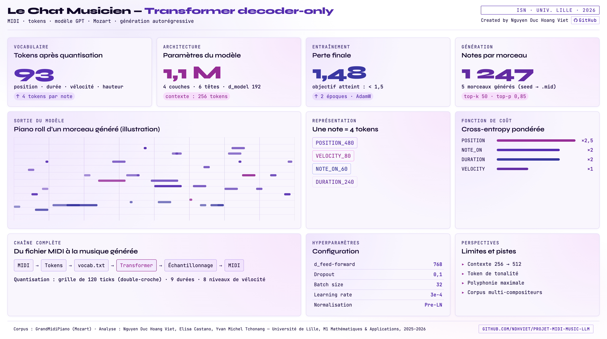

<div align="center">

<h1>MusicGPT</h1>

<p><em>Modèle de langage pour la génération automatique de musique MIDI</em></p>

<a href="#"></a>
<a href="#"></a>
<a href="#"></a>
<a href="#"></a>
<a href="#"></a>
<a href="#"></a>

</div>

<br>

# MusicGPT — Génération automatique de musique MIDI

MusicGPT est un modèle de langage entraîné sur des fichiers MIDI afin d'apprendre les régularités musicales et de générer de nouvelles séquences musicales à partir d'une séquence de notes en entrée.

Ce projet a été réalisé dans le cadre du Master 1 Ingénierie Numérique et Statistique – Data Science en 2025-2026.

L'objectif est d'explorer l'utilisation des modèles de langage pour la prédiction de séquences musicales et la génération automatique de musique au format MIDI.

## Réalisé par

| Membre | Contact |
|---|---|
| **Duc Hoang Viet NGUYEN** | [ndhviet.github.io](https://ndhviet.github.io/) |
| **Elisa CASTANO** | elisa.castano.etu@univ-lille.fr |
| **Yvan Michel TCHONANG** | [michel-tchonang.lovable.app](https://michel-tchonang.lovable.app/) |

## Consulter le rapport complet

Vous pouvez consulter le rapport détaillé du projet (format PDF) en cliquant sur le lien ci-dessous :

<a href="rapport.pdf" target="_blank" style="font-weight: bold; text-decoration: underline;">  Ouvrir le rapport PDF  </a>

## Prérequis

Python 3.11+ recommandé.

Créer et activer un environnement virtuel :
 
```bash
python3 -m venv llm-venv
 
# macOS / Linux
source llm-venv/bin/activate
 
# Windows
llm-venv\Scripts\activate
```
 
Puis installer les dépendances :
 
```bash
pip install -r requirements.txt
```

---

## Structure des fichiers

| Fichier | Rôle |
|---|---|
| `filter.py` | Filtrage des fichiers MIDI par compositeur |
| `h0.py` | Tokenisation des fichiers MIDI |
| `h1.py` | Architecture du modèle MusicGPT |
| `h2.py` | Entraînement du modèle |
| `h3.py` | Génération de nouveaux morceaux MIDI |

---

## Étapes pour reproduire le projet

### 1. Préparer les données

Le dossier `GrandMidiPiano/` contenant les fichiers MIDI doit être placé à la racine du projet (au même niveau que les fichiers `.py`), puis lancer le filtrage :
```bash
python filter.py
```

Cela crée les dossiers `mozart_dataset/` et `beethoven_dataset/`. Dans la suite du projet, nous travaillerons sur `mozart_dataset/`.

### 2. Tokeniser les données

```bash
python h0.py
```

Génère `vocab.txt` et `dataset.txt`.

### 3. Entraine le modèle
 
```bash
python h2.py
```
 
Le meilleur modèle est sauvegardé dans `checkpoints/best_model.pt`.
 
### 4. Générer de la musique
 
```bash
python h3.py
```
 
Les fichiers MIDI générés apparaissent dans le dossier `generated_music/`.

---

## Écouter les fichiers MIDI

Les fichiers `.mid` peuvent être ouverts avec :
- [signal.vercel.app](https://signal.vercel.app) (en ligne, gratuit)

- [miditoolbox.com/player](https://miditoolbox.com/player) (en ligne, gratuit)

---

## Notes

- L'entraînement peut prendre plusieurs dizaines de minutes selon la machine.
- Le dossier `checkpoints/` contient le modèle déjà entraîné — il est possible de passer directement à l'étape 4 sans réentraîner.

## Fichiers audio de démonstration
 
Le dossier `sample/` contient des exemples de morceaux générés par le modèle, convertis au format MP3 pour une écoute directe sans lecteur MIDI.

## Autre version

Une version alternative du projet a été développée par **Yvan Michel TCHONANG**, avec une approche différente : les fichiers MIDI sont d'abord convertis en fichiers CSV avant d'être utilisés pour l'entraînement du modèle.

Le code correspondant se trouve dans le dossier `michel/`.
 **Pour télécharger cette version du projet, cliquez sur le lien suivant :**  
[Télécharger la version Michel](https://drive.google.com/file/d/1zCtGJt5VyUaAaJJaxiEbPpnf1ostr_za/view?usp=sharing&utm_source=chatgpt.com)

### Dashboard 

[](https://ndhviet.github.io/Projet-Midi-Music-LLM/)

➡️ Cliquez sur l'image pour ouvrir le dashboard.
ici et ailleurs.
